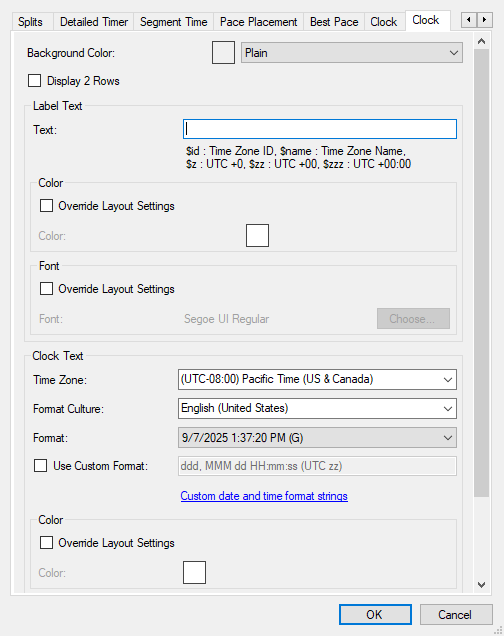

# Pokemon Red 2025 Tournament Tech Setup (In Progress)

## OBS Scene Setup
Download the [OBS setup](https://github.com/hwangbro/RedTournament/releases/download/v2/RED25_RUNNER_OBS.zip) for this year's tournament.

This is the OBS that you will be using to stream/record all of your tournament races this year. You can launch this OBS with the `RED RUNNER OBS LAUNCH.bat`.

### Runner Name
Click the `Runner Name` source and type in your own username. This will not be shown on stream, this is mainly to help identify your stream feeds from others for the restreamer's benefit.

### Game Feed
Click the `Game Feed` source and replace it with your own game feed. The game feed should cover as much of the blue area as possible.

If you are running on GSE, please enable `Hide Status Bar` in settings. There is also a filter on created for the `Game Feed` source to crop out the top menu bar for your convenience.

### LiveSplit

#### Main Timer
There are two parts of LiveSplit that will be added to the layout. Click the `LiveSplit Main Timer` source and point it to LiveSplit. Crop out just your main timer into the `LIVESPLIT MAIN TIMER` area.

It does not need to fill the entire space, just make sure it does not leave the marked area.

This will not be shown on stream, this is to help the restreamers sync the different feeds during the race.

#### Clock
Inside the downloaded .zip file, there is a `LiveSplit.Clock.dll`. Copy this file into your LiveSplit folder's `Components` directory.

When you open LiveSplit, click `Edit Layout` and add the Clock component, under `Other`.

Double click the new component and remove anything inside `Text`. You can set or ignore the timezone, it doesn't matter too much. At the end, your settings should look something like this.

- <details><summary>Clock</summary>
    
  </details>

Your LiveSplit should now have a new row that displays the current date and time. In OBS, click the `LiveSplit Clock`, source and point it to LiveSplit. Crop out just the clock line into the `LIVESPLIT CLOCK` area.

It does not need to fill the entire space, just make sure it does not leave the marked area.

This will not be shown on stream, this is to help the restreamers sync the different feeds.

### Game Audio
If you are on emulator, double click the `Game Audio` source and point it to your emulator. You should see game audio reflected in the Audio Mixer.

If you are on console, you can remove this source, and I trust you will know how to get game audio into OBS depending on your setup.

Make sure that game audio is the **only** thing that is in the audio mixer; no desktop or mic sources.

### Stream/Recording settings
Please set your recording path in OBS. Every race **must** be recorded locally in case the stream feed drops and additional verification is needed.

Otherwise, stream/recording settings should be adjusted based on your own hardware.

### Example
After everything has been setup, please click the eyeball next to the `HIDE THIS WHEN FINISHED` group. This will remove all the two text labels for LiveSplit.

Your layout should look something like this.

- <details><summary>Example</summary>
    
  </details>


## LiveSplit Setup
It is recommended you use the following split names to make split comparisons easier.

```
Nidoran
Brock
Route 3
Mt. Moon
Bridge
Misty
Surge
Fly
Flute
Koga
Erika
Blaine
Sabrina
Giovanni
Lorelei
Bruno
Agatha
Lance
Champion
Hall of Fame
```

## Racetime.gg Setup
- If you haven't already, create an account on [racetime.gg](https://racetime.gg/)
- Before your race starts, the restreamers should create a new race on racetime.gg. We strongly recommend joining the race through the LiveSplit-racetime.gg plugin.
    - Open LiveSplit, click `racetime.gg Races`, and you should see a new race for Pokemon Red/Blue. If this is your first time doing this through LiveSplit, it may prompt you to login and/or authorize LiveSplit.
- If you joined through LiveSplit, your timer should automatically be set to -15s before the race begins. Once everybody in the room clicks "Ready", the countdown will begin.
- You should click "New Game" when the timer hits "0" and the race will begin

## Pre-Race Tech Check
- All racers must get their tech setup checked before the day of the race. When you are ready to get checked, please ping `@restreamer` in the #tech-check channel and someone will try to schedule you for a check.
- This is mainly to ensure your layout looks good, you are able to stream/record successfully, and for us to check audio levels.
- Please do not procrastinate on doing this and get this done ASAP.

## Y No Restream??
- Due to the large number of participants this year and limited resources, there is a chance your race might not be restreamed.
- If this is the case, one of the organizers or restreamers will reach out to your race group and let you know in advanced.
- You will be asked to stream (& local record) your race to your normal twitch channel, using racetime.gg
    - Layout is flexible here, as long as it contains your game feed and **livesplit timer**
- You may still be asked to do some small run verification, like palette changes, before the race begins.

## Tournament Race Procedure
- On the day of the race, the restreamer will give you a stream key for you to use. You may choose to stream on your own twitch channel in parallel, but you **must** stream using our stream key for the tournament setup.
- All racers will be asked to join a discord voice channel for their race. During the actual race, all racers will be server deafened/muted with one of the restreamers in the channel.
    - In the rare circumstance that the restreamers need to talk directly to the racers, the restreamer will undeafen/unmute you and speak to you in the call.
- The commentators/restreamers should communicate with you to set an initial palette before the race begins. This is a countermeasure against runners using pre-recorded runs.
- They should specify this in the form of a direction + optional button, e.g. `LEFT+A` or `UP`. Make sure you set this palette and are using it when you begin the race.

## Post-Race Procedure
- After you are finished with your race and if you would like to join the stream for comments, please make a comment in either the racetime.gg race channel, ping the restreamer/commentators in discord, or in twitch chat.
- Someone will unmute/undeafen you and you will be able to talk to the commentators and any other racers present.

