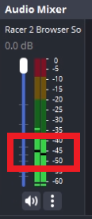

# Tech check verification steps
- You can do these steps from your own system but I recommend using the dedicated restream PC
- Join the user in a discord call and ask them to screen share their OBS
- Provide them a stream key (ask @hwangbro if you don't have)
- Ensure that their layout has all the necessary components (game feed, runner name, livesplit main timer/clock)
- Ensure that their OBS is recording game audio
- Have them start recording and ensure there are no issues (no crashes/settings, etc)
- Have them start streaming and check to see if the stream goes online
- Check their audio level, ensure that the dark bar in the stream PC's OBS is between -40 and -45db
- Update spreadsheet, note any gain used if any

- 

Audio Example

    
  

